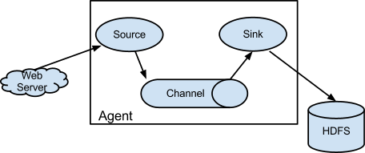
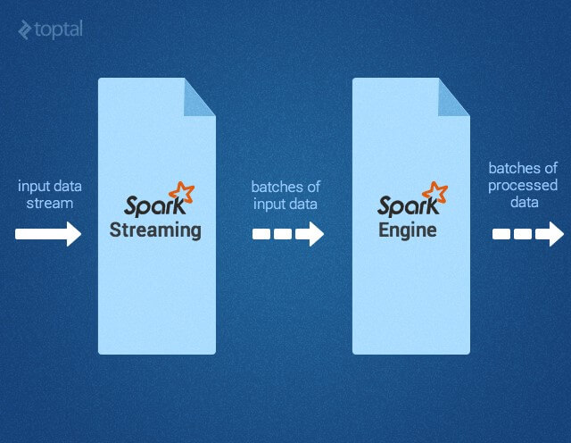
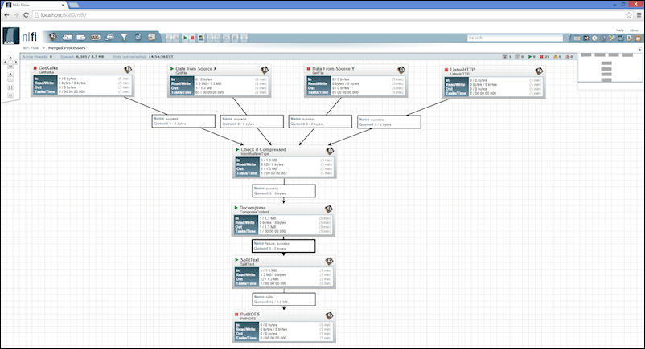
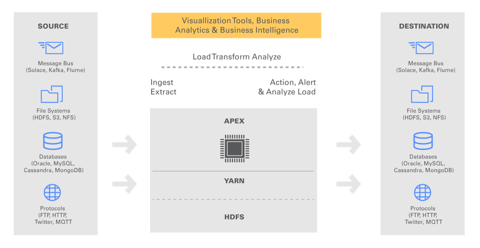
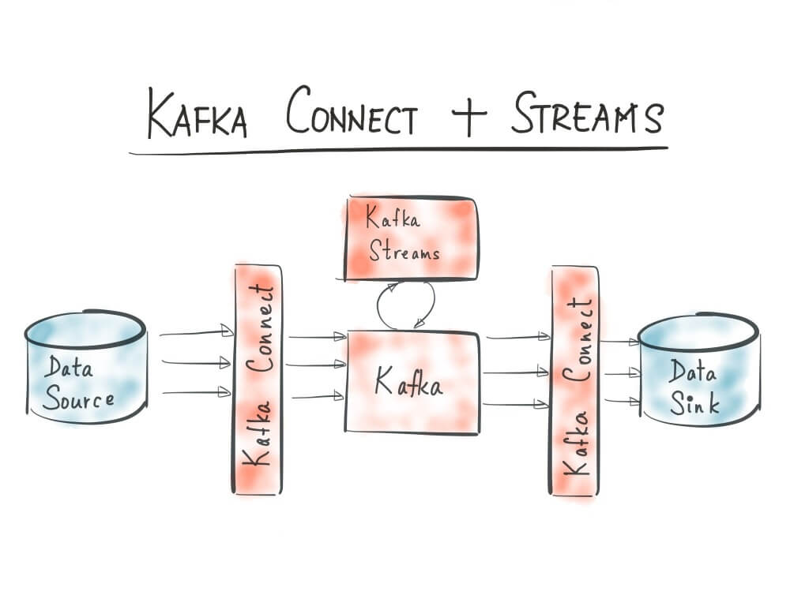
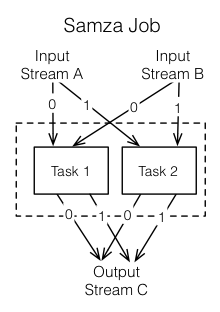
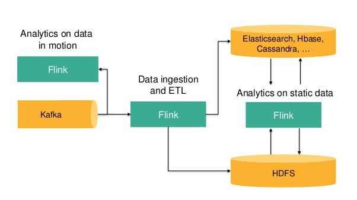
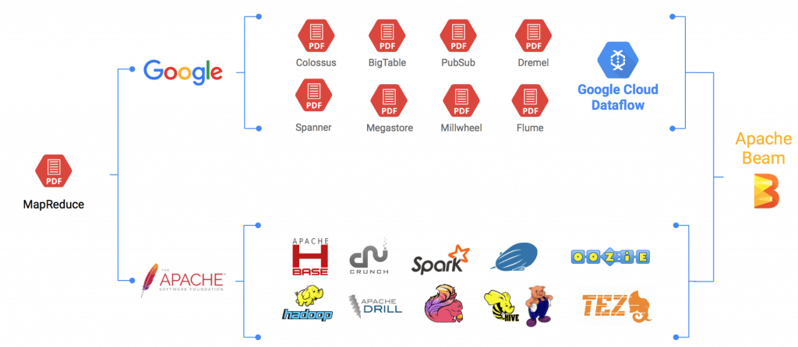
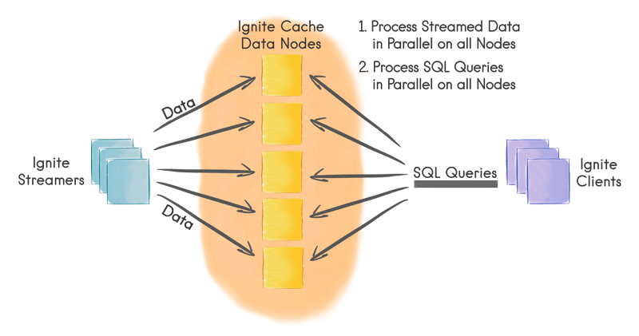

Lets consider the various streaming options available in Big Data

### Apache Flume

Apache Flume is one of the oldest Apache projects designed to collect, aggregate, and move large data sets such as web server logs to a centralized location.  
It belongs to the data collection and single-event processing family of stream processing solutions.  

Flume is based on an agent-driven architecture in which the events generated by clients are streamed directly to Apache Hive, HBase or other data stores.  

Flume’s configuration includes a source, channel, and sink.  
* The source can be anything from a Syslog to the Twitter stream to an Avro endpoint.
* The channel defines how the stream is delivered to the destination. The valid options include Memory, JDBC, Kafka, File among others.
* The sink determines the destination where the stream gets delivered. Flume supports many sinks such as HDFS, Hive, HBase, ElasticSearch, Kafka and others.

Apache Flume is ideal for scenarios where the client infrastructure supports installing agents. The most popular use case is to stream logs from multiple sources to a central, persistent data store for further processing analysis.

**Sample Use Case**: Streaming logs from multiple sources capable of running JVM.

  
  
### Apache Spark

Apache Spark is the hottest technology in the big data ecosystem.   
It gained the attention of data scientists and developers for its fast, in-memory processing capabilities combined with  expressive development APIs.

Spark was originally developed at the University of California, Berkeley’s AMPLab, which was later donated to the Apache Software Foundation.  

Apache Spark provides developers with an API that’s centered around a data structure called the resilient distributed dataset (RDD), which is a read-only multiset of data items distributed over a cluster of machines, which is fault-tolerant. 

Spark is designed to overcome the limitations of MapReduce where RDDs function as a working set for distributed programs taking advantage of distributed shared memory.

Spark claims to be 100 times faster than Hadoop MapReduce in memory, or 10 times faster when run on disk.

Spark is written in Scala but supports multiple programming languages.

It comes with adapters for working with data stored in diverse  sources, including HDFS files, Cassandra, HBase, and Amazon S3.

Spark Streaming is an essential component for building fault-tolerant streaming applications.   
It enables developers to build streaming applications through Sparks’ high-level API.  
Since it runs on Spark, Spark Streaming lets developers reuse the same code for batch processing, join streams against historical data, or run ad-hoc queries on stream state.  
It can be used to build powerful interactive applications beyond traditional analytics.  
Spark Streaming operates in micro-batching mode where the batch size is much smaller to conventional batch processing.

Though not a strict requirement, Spark can be run on existing Hadoop and Mesos clusters.  
It provides a shell for exploring data interactively.  
Apache Spark, when combined with Apache Kafka, delivers a powerful stream processing environment.

**Sample Use Case**: Processing social media feeds in real-time for performing sentiment analysis.

### Apache Storm
Apache Storm was originally developed by Nathan Marz at BackType, a company that was acquired by Twitter.  
After the acquisition, Twitter open sourced Storm before donating it to Apache.  
Trusted by companies such as Flipboard, Yahoo!, and Twitter, it has emerged as the standard for developing distributed, real-time, data processing platforms.  

Storm is often referred as the Hadoop for real-time processing.   
According to the official documentation, “Storm makes it easy to reliably process unbounded streams of data, doing for realtime processing what Hadoop did for batch processing.”  

Apache Storm is primarily designed for scalability and fault-tolerance.  
It guarantees that every tuple will be processed at least once.  
Though it is written in Clojure, applications can be written in any programming language that can read and write to standard input and output streams.  

Storm is designed to support connecting input streams, called as  “spouts” and “bolts,” which are processing and output modules.  
A collection of spouts and bolts form directed acyclic graph (DAG), which is called as a topology.  

Based on the pre-defined configuration, topologies run on clusters with the scheduler distributing the work across nodes that are part of the cluster.  
Storm topologies are often compared to Hadoop MapReduce jobs. But unlike Hadoop jobs, topologies run continuously till they are terminated.  

Within a topology, spouts acquire the data which will go through a series of bolts. Each bolt is responsible for transforming or processing the data.  
Some bolts may write the data into persistent databases or files while others may call third party APIs to transform data.

Thanks to the open source ecosystem, there is a rich collection of spouts for popular data sources, which were created by the community.

Through the concepts of adapters, Storm can interoperate with HDFS file systems to participate in Hadoop jobs.  
Storm is commonly used in combination with other data ingestion and processing components such as Apache Kafka and Apache Spark.  

It delivers a reliable, scalable, fault-tolerant distributed computing framework.

**Sample Use Case:** Transform and process social media / IoT sensor streams in real-time.

### Apache NiFi
When compared to other streaming solutions, Apache NiFi is a relatively new project that got graduated to become an Apache Top-Level project in July 2015. 

It is based on Enterprise Integration Patterns (EIP) where the data flows through multiple stages and transformations before reaching the destination.

Apache NiFi comes with a highly intuitive graphical interface that makes it easy to design data flow and transformations.  
Business analysts and decision makers can use the tool to define the data flow.   
It supports a variety of input sources that include both static and streaming data sets.  
Data that’s acquired from sources such as file system, social media streams, Kafka, FTP, HTTP, JMS, can flow to a variety of destinations including ElasticSearch, Amazon S3, AWS Lambda, Splunk, Solr, SQL, and NoSQL databases.  
Transformations can be introduced into the path of the data flow.

The emerging area of industrial IoT demands a robust, reliable, and secure data flow engine.  

Apache NiFi has the potential to become the most preferred orchestration engine for processing sensor data in IoT implementations.   
It offers the simplicity of Node-Red with the power of Big Data.  
Inbuilt support for Kafka, JMS, and other channels makes it an ideal choice for enterprise IoT solutions.

One of the classic scenarios that Apache NiFi addresses is the creation of hot path and cold path analytics.  
The data sets generated by IoT devices and sensor contain certain data points that need to be analyzed in real-time while a subset of the data is stored for batch processing. Such data sets are typically streamed via high-velocity engines such as Apache Kafka, Amazon Kinesis, and Azure Event Hubs. Apache NiFi can be used to define two separate paths for the same data sets responsible for near real-time processing (hot path) and batch processing (cold path).

**Sample Use Case:** An interactive rules engine to define the flow of IoT sensor data.

### Apache Apex

DataTorrent, a Silicon Valley-based company, donated one of its real-time streaming commercial products to Apache Foundation, which is now called Apache Apex.  
It’s one of the youngest projects at Apache that got graduated from the incubator to become a Top-Level Project.  
Apache Apex is positioned as an alternative to Apache Storm and Apache Spark for real-time stream processing.  
It’s claimed to be at least 10 to 100 times faster than Spark.  
When compared to Apache Spark, Apex comes with enterprise features such as event processing, guaranteed order of event delivery, and fault-tolerance at the core platform level.   
Unlike Spark, which needs strong Scala skills, Apex can be used by exiting Java developers.  
It is designed to run well within the existing Hadoop ecosystem, using YARN for scaling up or down while using HDFS for fault tolerance.

Apache Apex is positioned as industry’s only open-source enterprise-grade engine capable of handling batch data as well as streaming data needs.   
It is a data-in-motion platform that allows for a unification of processing of real-time streams of unbounded data (streaming job), or bounded data in conventional files (batch job).  
Organizations can build applications to suit their business logic, and extend the applications across batch processing as well as streaming jobs. 

Apache Apex architecture can handle reading from and writing to message buses, file systems, databases or any other sources.  
As long as these sources have client code that can be run within a JVM, the integration works seamlessly.  

Apex comes with a library of operators called Malhar, which are pre-built operators for data sources and destinations such as message buses, file systems, and databases.  
These operators enable developers to build quickly business logic that deals with a variety of data sources.   

The overall goal of Apex is to reduce the complexity of Big Data projects in enterprises.

**Sample Use Case:** Applications running on a fault-tolerant infrastructure that are required to process heterogeneous data sets in real-time as well as in batch-mode.

### Apache Kafka Streams
Kafka Streams is just a library built on top of the popular data ingestion platform, Apache Kafka.  
The source code is available as a part of Kafka project.  
It’s contributed by Confluent, a startup that’s founded by the original developers of Kafka project at LinkedIn.

During the recent past, Apache Kafka emerged as the most popular real-time, large-scale messaging system.  
It has quickly become the core infrastructure building block for contemporary data platforms.  
It is used across a wide range of industries by thousands of companies, including Netflix, Cisco, PayPal, and Twitter.  

Kafka is also exposed as a managed service by the public cloud providers offering hosted Big Data and analytics platforms.

Kafka Streams is a library for building streaming applications, specifically those applications that dealing with transforming input Kafka topics into output Kafka topics.  
It is not designed for large analytics but for microservices that deliver efficient and compact stream processing.  
What this means is that the Kafka Streams library is designed to be integrated into the core business logic of an application rather than being a part of a batch analytics job.

Kafka Streams relieve users from setting up, configuring, and managing complex Spark clusters solely deployed for stream processing.  
It simplifies stream processing to make it accessible as a stand-alone application programming model for asynchronous services.  
Developers can embed Kafka Streams functionality without the need for a stream processing cluster.  
The architecture will have Apache Kafka and an application without an external dependency.  

Kafka Streams deliver a processing model that is fully integrated with the core abstractions Kafka provides to reduce the total number of moving pieces in a stream architecture.  

It is not a part of MapReduce code that’s typically written to deal with batch processing.

While discussing Kafka Streams, it’s also important to touch upon Kafka Connect, which is a framework for reliably connecting Kafka with external systems such as databases, key-value stores, search indexes, and file systems.

The best thing about Kafka Streams is that it can be packaged as a container that can be on Docker.  
DevOps teams can also use Ansible, Puppet, Chef, Salt, or even shell script to deploy and manage the application.  
Once packaged as a container, it can be integrated with orchestration engines such as Docker Swarm, Kubernetes, DC/OS, Yarn, and others.

**Sample Use Case:** Microservices and stand-alone applications that need embedded stream processing capabilities without the dependency on complex clusters.

### Apache Samza
Apache Samza was developed at LinkedIn to avoid the large turn-around times involved in Hadoop’s batch processing.  
It is built on top of Apache Kafka, a low-latency distributed messaging system.  

Samza was built to provide a lightweight framework for continuous data processing.  
The combination of Kafka and Samza is analogous to HDFS and MapReduce. If HDFS acts as the input for MapReduce jobs, Kafka ingests data processed by Samza.  

Samza can continuously compute results as and when the data arrives delivering sub-second response times.

After getting the input from streams, Samza executes a job, which is the code that consumes and processes a set of input streams.  
Jobs may be written in Java, Scala or other languages that support JVM.  
For scalability, jobs are further broken down into smaller execution units called tasks, which is the unit of parallelism, just as the partition is to the stream.  
Each task consumes data delivered by one of the partitions.  
A task processes messages from each of its input partitions sequentially, in the order of message offset. There is no defined ordering across partitions, allowing each task to operate independently.

Samza groups multiple tasks that are executed inside one or more containers, which are isolated OS processes running a JVM that is responsible for executing a set of tasks for a single job. Containers are single threaded which are responsible for managing the lifecycle of tasks.

The key difference between Samza and other streaming technologies lies in its stateful streaming processing capability.  
Samza tasks have dedicated key/value store co-located on the same machine as the task. 
This architecture delivers better read/write performance than any other streaming processing software.

Since Samza evolved from extensive usage of Kafka at LinkedIn, they have a great compatibility.  
It becomes a natural choice in architectures where Kafka is used for ingestion.

Apache Samza and Kafka Streams address the same problem with the later being an embeddable library than a full-fledged software.

**Sample Use Case:** Optimized stream processing for applications utilizing Kafka for ingestion.

### Apache Flink
Apache Flink was originally developed as “Stratosphere: Information Management on the Cloud” in 2010 at Germany as a collaboration of Technical University Berlin, Humboldt-Universität zu Berlin, and Hasso-Plattner-Institut Potsdam.   
After its submission to Apache Software Foundation, it became a Top-Level Project in December 2014. 

At first, The concepts and use cases of Apache Flink looks similar to Apache Spark.  
It aims to be a single platform for running batch, streaming, interactive, graph processing and machine learning applications.  

But there are differences in the implementation between Spark and Flink.
* Spark Streaming is designed to deal with mini batches which can deliver near real-time capabilities. 
* Apache Flink delivers real-time processing due to the fine-grained event level processing architecture.

Flink brings a few unique capabilities to stream processing.  
It provides exactly-once guarantees to state updates freeing the developers from the burden of dealing with duplicates. 
It has a high-throughput engine which can buffer events before they sent over the distributed network. 
Flink provides a powerful streaming programming model with flexible windowing schemes.

Flink is built to be both, a DataStream API for stream analytics and a DataSet API for batch analytics on top of the underlying stream processing engine.  
Apache Flink supports programs written in Java or Scala, which get automatically compiled and optimized into data flow programs.  
Flink does not have its data storage system. The input data can come from a distributed storage system like HDFS or HBase. 

For data stream processing, Flink can consume data from message queues such as Kafka.

**Sample Use Case:** Detection and prevention of fraudulent credit card transactions in real-time.

### Apache Beam
Apache Beam is the latest addition to the growing list of streaming projects at the Apache Software Foundation.  
The name of this project signifies the design, which is a combination of Batch and Stream processing models.  
It is based on a unified model for defining and executing data-parallel processing pipelines that come with a set of language-specific SDKs for constructing pipelines and runtime-specific Runners for executing them.  

Google, along with data Artisans, Cloudera, and PayPal donated the SDK of its Big Data services, Cloud Dataflow to ASF, which has become the foundation of Apache Beam.   
It evolved from a variety of internal Google projects such as MapReduce, FlumeJava, and Millwheel. 

The concept of Pipeline Runners in Beam translates data processing pipelines into an API that’s compatible with multiple distributed processing backends.  
A pipeline is a chain of processes that work on a dataset.  
Each Beam Program will have a runner for the back-end depending on where the pipeline is executed.  
The platform currently supports runners including Google Cloud Dataflow, Apache Flink, and Apache Spark.  
Other runners such as Storm and MapReduce are in works.

**What problem does Beam solve?**  
When MapReduce jobs get migrated from Hadoop to Spark or Flink, a lot of refactoring is required.  
Dataflow attempts to be an abstraction layer between the code and execution runtime.  
When the code is implemented in Dataflow SDK, it will run on multiple backends such as Flink and Spark.  
Beam supports Java and Python with other language bindings in the works.  
It aims at bringing multiple languages, frameworks, and SDKs into one unified programming model.

**Sample Use Case:** Applications that depend on multiple frameworks including Flink and Spark.

### Apache Ignite
Apache Ignite is an in-memory layer built on top of a distributed in-memory computing platform.  
It is optimized to process large data sets in real time.  
The in-memory architecture makes it much faster than what is possible with traditional disk-based or flash-based technologies.

The project was originally developed by GridGain Systems which donated it to ASF in 2014.  
In September 2015, Ignite graduated from incubation to become a TLP.

Though both Spark and Ignite rely on distributed in-memory processing architecture, there is subtle difference between the two.
* Spark is primarily designed for interactive analytics and machine learning applications, while Ignite is meant to deliver programmatic real-time analytics, machine-to-machine communication, and high-performance transactional processing.

Ignite has the potential to become the preferred solution for transaction processing systems such as stock trading, fraud detection, real-time modeling and analysis.  
It works equally well with scale-out architecture running on commodity hardware or with vertical scaling on high-end workstations and servers.

Ignite streaming feature allows processing continuous never-ending streams of data in scalable and fault-tolerant fashion. The rates at which data can be injected into Ignite can be very high and easily exceed millions of events per second on a moderately sized cluster.

**Sample Use Case:** Applications that heavily rely on programmatic real-time analytics, machine-to-machine communication, and high-performance transactional processing.